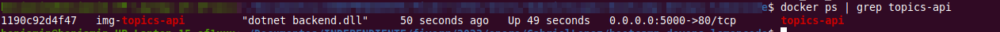
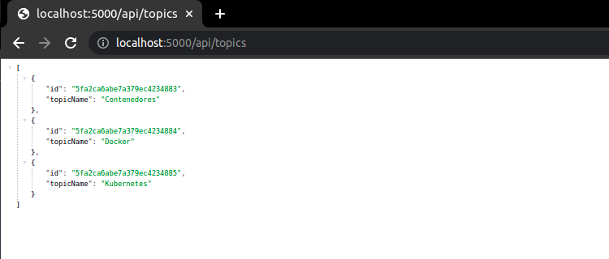
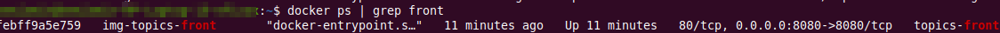
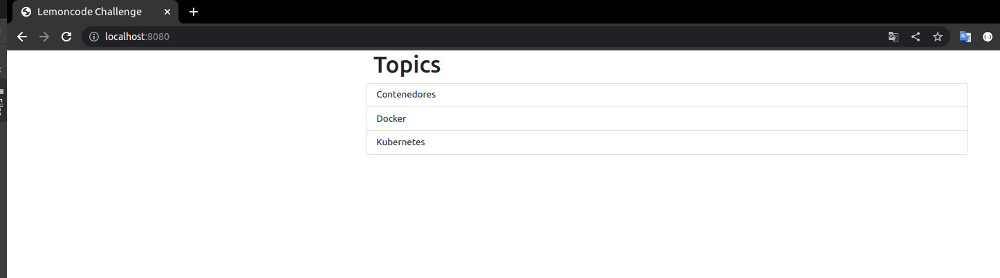
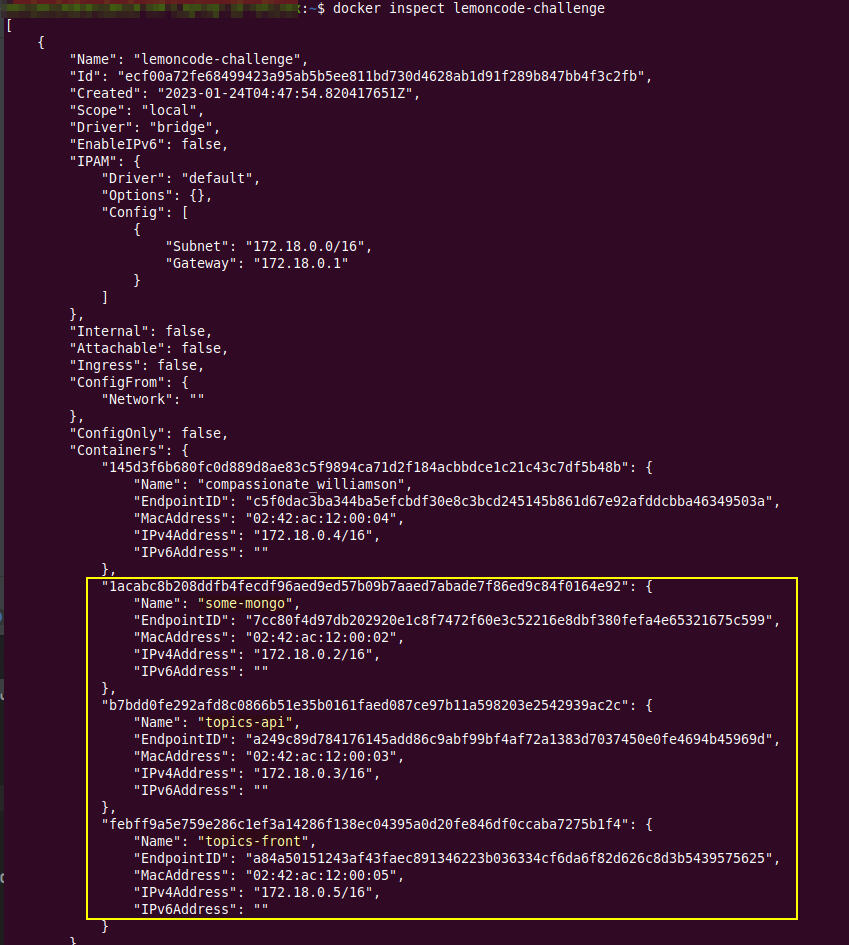

# MÓDULO 02

## EJERCICIO 01

### MONGODB
#### Crear red docker
Crearemos nuestra red con el siguiente comando, tener en cuenta que colocara a nuestra red por defecto en bridge.
````bash
docker network create lemoncode-challenge
````

#### Crear volumen docker
Crearemos nuestra volumen para la base de datos mongodb (el nombre es variable)
````bash
docker volume create lemoncode-challenge-data
````

#### Crear contenedor MongoDB
Procedemos a crear el contenedor mongodb desde la linea de comandos de docker.

````bash
docker run --name some-mongo \
--network lemoncode-challenge \
-p 27017:27017 \
--mount source=lemoncode-challenge-data,target=/data/db \
-d mongo
````
Verificamos la creación del mongodb

````bash
telnet localhost 27017
````

#### Crear DataBase
Para crear una base de datos llamada TopicstoreDb y una colección llamada Topics en MongoDB, debe seguir los siguientes pasos:

- Conectese a la instancia de MongoDB usando el comando "mongo".
- Cree la base de datos TopicstoreDb usando el comando "use TopicstoreDb".
- Cree una colección llamada Topics usando el comando "db.createCollection("Topics")".
- Para agregar varios registros a la colección Topics, puede usar el comando "db.Topics.insertMany([{ _id: ObjectId("5fa2ca6abe7a379ec4234883"), Name: "Contenedores"}])"
- Puede comprobar si la base de datos y la colección se han creado correctamente usando el comando "show dbs" y "show collections" respectivamente.
- Para ver los registros insertados en Topics, puedes usar el comando "db.Topics.find()"

````bash
use TopicstoreDb
db.createCollection("Topics")
db.Topics.insertMany([{ _id: ObjectId("5fa2ca6abe7a379ec4234883"), Name: "Contenedores" }, { _id: ObjectId("5fa2ca6abe7a379ec4234884"), Name: "Docker" }, { _id: ObjectId("5fa2ca6abe7a379ec4234885"), Name: "Kubernetes" }])
show dbs
show collections
db.Topics.find()
````

### .NET
#### Crear el docker file
Creamos el docker file para nuestra aplicación, nos ubicamos dentro de la carpeta ejercicio01 del modulo02
Ingresamos dentro de la carpeta de nuestra aplicación backend
````bash
cd dotnet-stack/backend/
````
creamos un archivo "Dockerfile"
````bash
vim Dockerfile
````
Ingresamos el siguiente contendido
````bash
FROM mcr.microsoft.com/dotnet/core/sdk:3.1 AS base
WORKDIR /app

FROM base AS builder
COPY ["*.csproj","*.csproj.user","./"]
RUN dotnet restore
COPY . ./
RUN dotnet publish -c Release -o out

FROM base AS runtime
COPY --from=builder /app/out .
ARG BUILD_CONFIGURATION=Debug
ENV ASPNETCORE_ENVIRONMENT=Development
ENV DOTNET_USE_POLLING_FILE_WATCHER=true
ENV ASPNETCORE_URLS=http://+:5000
EXPOSE 5000
ENTRYPOINT ["dotnet", "backend.dll"]
````
Descargamos la imagen base de nuestro dockerfile
````bash
docker pull mcr.microsoft.com/dotnet/core/sdk:3.1
````
Generamos la imagen Docker a partir de nuestro Dockerfile
````bash
docker build -t img-topics-api .
````
Creamos nuestro contenedor a partir de nuestra imagen Docker.
````bash
docker run -d --name topics-api \
--network lemoncode-challenge \
-p 5000:5000 \
-e MONGO_URI=some-mongo:27017  \
img-topics-api
````

Validamos que nuestro contenedor se esté ejecutando
````bash
docker ps | grep topics-api
````


Validamos el correcto funcionamiento de la API
desde un navegador



desde la terminal

````bash
curl http://localhost:5000/api/topics
````


### Front-end
#### Crear red docker
#### Crear el docker file
Creamos el docker file para nuestro front-end, nos ubicamos dentro de la carpeta ejercicio01 del modulo02
Ingresamos dentro de la carpeta de nuestra aplicación front-end
````bash
cd dotnet-stack/frontend/
````
creamos un archivo "Dockerfile"
````bash
vim Dockerfile
````
Ingresamos el siguiente contendido
````bash
FROM node:14.5.0-alpine
WORKDIR /usr/src/app
ENV PATH /usr/src/app/node_modules/.bin:$PATH
COPY ["package.json", "package-lock.json", "./"]
RUN npm install -g react-scripts --silent
RUN npm install --silent
COPY . .
EXPOSE 8080
CMD ["npm", "start"]
````
Descargamos la imagen base de nuestro dockerfile
````bash
docker pull node:14.5.0-alpine
````
Generamos la imagen Docker a partir de nuestro Dockerfile
````bash
docker build -t img-topics-front .
````
Creamos nuestro contenedor a partir de nuestra imagen Docker.
````bash
docker run --name topics-front \
--network lemoncode-challenge \
-p 8080:8080 \
-e API_URI=http://topics-api:5000/api/topics \
img-topics-front
````
Validamos que nuestro contenedor se esté ejecutando
````bash
docker ps | grep front
````



Validamos el correcto funcionamiento del Front-end
desde un navegador:



Desde la terminal:

````bash
curl http://localhost:8080
````

Para finalizar verificamos que nuestros contendores se encuentren en la misma red de docker.

Ejecutamos el siguiente comando
````bash
docker inspect lemoncode-challenge
````

