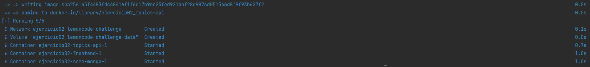
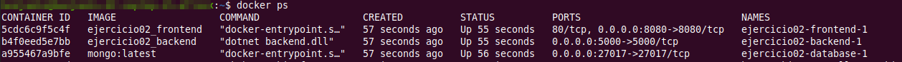
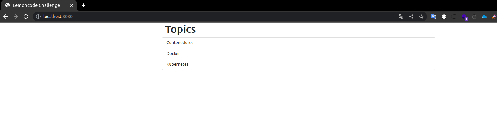

# MÓDULO 02

## EJERCICIO 02

### DOCKER-COMPOSE
#### Crear docker-compose
Para desplegar las aplicaciones del ejercicio 1 con Docker Compose, se deben seguir los siguientes pasos:
1) Crear un archivo llamado docker-compose.yml en el directorio raíz de la aplicación con el siguiente contenido:
````bash
cd /ejercicio2
vim docker-compose.yml
````
Ingresamos el siguiente contenido a nuestros docker-compose.yml según las aplicaciones que deseamos desplegar.
````bash
version: '3.8'
services:
  some-mongo:
    image: mongo:latest
    volumes:
      - lemoncode-challenge-data:/data/db
    ports:
      - "27017:27017"
    restart: always
    networks: 
        - lemoncode-challenge
  topics-api:
    depends_on:
      - database
    build: ./dotnet-stack/backend
    ports:
      - "5000:5000"
    restart: always
    environment:
      MONGO_URI: some-mongo:27017
    networks: 
      - lemoncode-challenge
  frontend:
    depends_on:
      - backend
    build: ./dotnet-stack/frontend
    ports:
      - "8080:8080"
    restart: always
    environment:
      API_URI: http://topics-api:5000/api/topics
    networks: 
      - lemoncode-challenge
volumes:
    lemoncode-challenge-data:
networks:
    lemoncode-challenge:
````
### Levantar el entorno
Ejecutar el comando docker-compose up para levantar el entorno, teniendo en cuenta que estemos en la altura del archivo docker-compose.yaml.
````bash
cd /ejercicio2
docker-compose up -d
````


Verificamos que los contendores se encuentren levantados



Verificamos la creación del mongodb

````bash
telnet localhost 27017
````

#### Crear DataBase
Para crear una base de datos llamada TopicstoreDb y una colección llamada Topics en MongoDB, debe seguir los siguientes pasos:

- Conectese a la instancia de MongoDB usando el comando "mongo".
- Cree la base de datos TopicstoreDb usando el comando "use TopicstoreDb".
- Cree una colección llamada Topics usando el comando "db.createCollection("Topics")".
- Para agregar varios registros a la colección Topics, puede usar el comando "db.Topics.insertMany([{ _id: ObjectId("5fa2ca6abe7a379ec4234883"), Name: "Contenedores"}])"
- Puede comprobar si la base de datos y la colección se han creado correctamente usando el comando "show dbs" y "show collections" respectivamente.
- Para ver los registros insertados en Topics, puedes usar el comando "db.Topics.find()"

````bash
use TopicstoreDb
db.createCollection("Topics")
db.Topics.insertMany([{ _id: ObjectId("5fa2ca6abe7a379ec4234883"), Name: "Contenedores" }, { _id: ObjectId("5fa2ca6abe7a379ec4234884"), Name: "Docker" }, { _id: ObjectId("5fa2ca6abe7a379ec4234885"), Name: "Kubernetes" }])
show dbs
show collections
db.Topics.find()
````


### Detener el entorno

Para detener el entorno, ejecutar el comando docker-compose down.
````bash
docker-compose down
````
### Eliminar el entorno
Para eliminar el entorno, ejecutar el comando docker-compose down.

````bash
docker-compose down
````
Si deseamos eliminar los volumes dentro de nuestro entorno podemos agregar opción --volumes.

````bash
docker-compose down --volumes
````

Validamos el correcto funcionamiento del Front-end 
desde un navegador:

