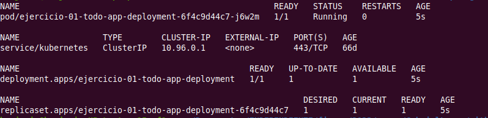
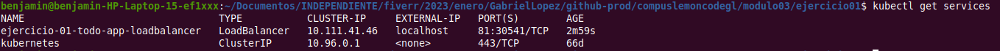
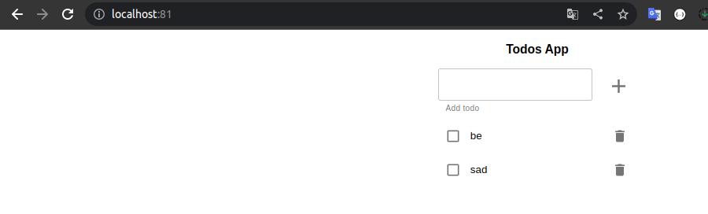

# MÓDULO 03

## EJERCICIO 01

### Verificamos nuestro cluster de kubernetes 
ejecutamos el siguiente comando el cual mostrara los pods por defecto que tendrá nuestro cluster de kubernetes.
````bash
kubectl get pods -A
````

## Construir imagen docker
Para construir la imagen de esta aplicación los pasos están expuestos en 00-
monolith-in-mem/README.md

````bash
cd 00-monolith-in-mem/todo-app
docker build -t todo-app-imagen .
````

## Verificamos nuestra imagen
````bash
docker images | grep todo-app-imagen
````
## Crear contenedor de prueba
````bash
docker run -d -p 3000:3000 \
  -e NODE_ENV=production \
  -e PORT=3000 \
  --name todo-app-container \
  todo-app-imagen
````
### Verificamos el contenedor
````bash
docker ps | grep todo
````
### Eliminamos el contenedor
````bash
docker rm -fv todo-app-container
````

### Desplegar deploy
#### Crear archivo deploy
````bash
cd ejercicio01
vim deploy.yaml
````
Contenido

````bash
apiVersion: apps/v1
kind: Deployment
metadata:
  name: ejercicio-01-todo-app-deployment
  labels:
    app: ejercicio-01-todo-app-deployment
spec:
  replicas: 1
  selector:
    matchLabels:
      app: todo-app
  template:
    metadata:
      labels:
        app: todo-app
    spec:
      containers:
      - name: todo-app
        image: todo-app-imagen
        imagePullPolicy: Always
        resources:
          requests:
            memory: "128Mi"
            cpu: "500m"
          limits:
            memory: "512Mi"
            cpu: "1000m"
        ports:
        - containerPort: 80
        env:
          - name: NODE_ENV
            value: "development"
          - name: PORT
            value: "80"
````
#### Desplegar el recurso
Desplegamos el recurso deploy en nuestro cluster de kubernetes local
````bash
kubectl apply -f deploy.yaml
````
verificamos el despliegue de los recursos


### Desplegar load-balancer
#### Crear archivo deploy
````bash
cd ejercicio01
vim loadbalancer.yaml
````
Contenido

````bash
apiVersion: v1
kind: Service
metadata:
  name:  ejercicio-01-todo-app-loadbalancer
spec:
  selector:
    app: todo-app
  ports:
    - port: 81
      targetPort: 80
  type: LoadBalancer
````
#### Desplegar el recurso
Desplegamos el recurso LoadBalancer en nuestro cluster de kubernetes local
````bash
kubectl apply -f loadbalancer.yaml
````
Verificamos el despliegue de los recursos


verificamos desde nuestro navegador

