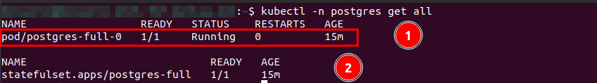
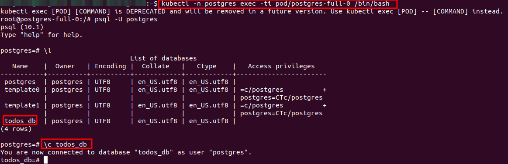
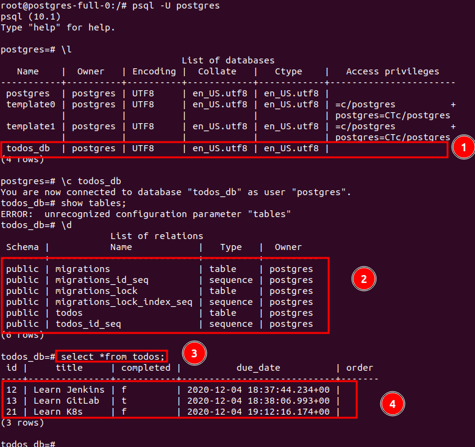
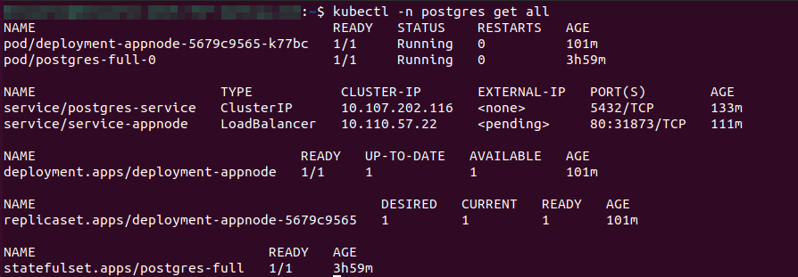
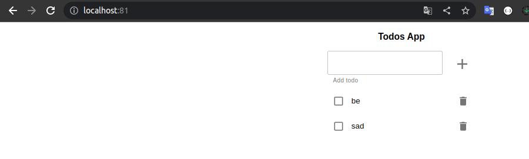

# MÓDULO 03

## EJERCICIO 02 

### Paso 1. Crear una capa de persistencia de datos

#### Crear namespace

````bash
cd ejercicio02

kubectl apply -f 00-namespace-postgres.yaml
````
#### Crear ConfigMap

````bash
kubectl apply -f 01-configmap.yaml
````

#### Crear PersistentVolume

````bash
kubectl apply -f 02-persistentvolume.yaml
````
#### Crear PersistentVolumeClaim

````bash
kubectl apply -f 03-persistentvolumeclaim.yaml
````

#### Crear StatefulSet

````bash
kubectl apply -f 04-statefulset.yaml 
````

Una vez tengamos nuestro StatefulSet corriendo la manera más directa de generar la base de datos sería:

Ejecutamos kubectl get pods, y obtenemos el nombre del pod relacionado con el StatefulSet.




Ejecutamos kubectl exec  -it [postgres-pod-name] /bin/bash
Ejecutamos psql -U postgres, pegamos todo-app/todos_db.sql y pulsamos enter, la base de datos debería estar generada




Verificamos los datos ingresados



Desplegar aplicación 2


## Running the Application with Docker on Local


### Paso 2. Crear todo-app
ingresamos a la siguente ruta

```bash
cd ejercicio02/01-monolith/todo-app
```
Creamos la imagen docker
```bash
docker build -t jaimesalas/lc-todo-monolith . 
```

#### Crear ConfigMap

````bash
kubectl apply -f 06-configmap-appnode.yaml
````

#### Crear Deployment 

````bash
kubectl apply -f 07-deployment-appnode.yaml
````
#### Crear loadbalancer

````bash
kubectl apply -f 08-loadbalancer-appnode.yaml
````

Verificamos que todos nuestro recursos esten corriendo



De la misma forma verificamos que la aplicación devuelve los datos que se encuentran en la base datos



