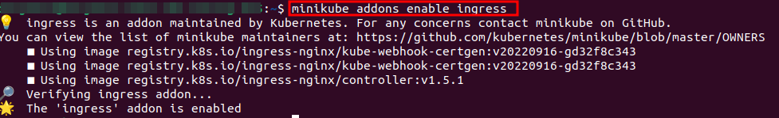

# MÓDULO 03

## EJERCICIO 03

### Paso 1. Crear todo-front.

#### Construir la imagen docker todo-front

ingresamos a la ruta 
````bash
cd ejercicio03/02-distributed/todo-front
````
Generamos la imagen docker para el todo-front

````bash
docker build -t todo-front .
````

#### Crear Deployment 

````bash
kubectl apply -f 01-deploy-todo-front.yaml
````

#### Crear Cluster api

````bash
kubectl apply -f 02-clusterip-todo-front.yaml
````

verioficamos la creación de nuestros recurso


### Paso 2. Crear todo-api.

#### Construir la imagen docker todo-api

ingresamos a la ruta
````bash
cd ejercicio03/02-distributed/todo-api
````
Generamos la imagen docker para el todo-front

````bash
docker build -t todo-api .
````
#### Crear ConfigMap

````bash
kubectl apply -f 03-configmap-todo-api.yaml
````
#### Crear Deployment

````bash
kubectl apply -f 04-deployment-todo-api.yaml
````

#### Crear Cluster api

````bash
kubectl apply -f 05-clusterip-todo-api.yaml
````

Verificamos los recursos creados


Paso 3. Crear un Ingress para acceder a los servicios del clúster

ya que estamos utilizando minikube instalaremos el complemento o plugin para ingress.


````bash
minikube addons enable ingress
````


#### Crear Ingress api

````bash
kubectl apply -f 06-ingress-todo.yaml
````

verificamos la creación de nuestro ingress

